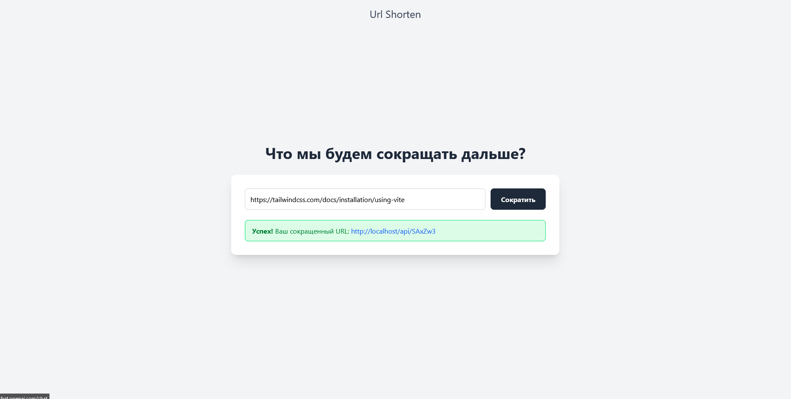

# URL Shortener

<!-- Вставьте сюда скриншот вашего сайта -->
[](http://localhost:8000)

Сервис для сокращения длинных URL-адресов, разработанный с использованием современных технологий.

## 🌟 Ключевые особенности

- **Быстрое и интуитивно понятное сокращение URL:** Удобный интерфейс для создания коротких ссылок.
- **Высокая производительность:** Оптимизирован для быстрой обработки запросов.
- **Надежное хранение данных:** Использование Redis для эффективного кеширования и хранения URL-адресов.
- **Масштабируемость и простота развертывания:** Контейнеризация с помощью Docker для легкого запуска и масштабирования.
- **Современный фронтенд:** Пользовательский интерфейс, созданный на React с использованием Tailwind CSS.
- **Стабильный бэкенд:** Разработан на Python с использованием FastAPI и Uvicorn.
- **Ограничение количества запросов (Rate Limiting):** Защита от злоупотреблений.
- **Полная документация API:** Подробное описание всех доступных эндпоинтов.

## 🛠️ Технологический стек

- **Бэкенд:** Python, FastAPI, Uvicorn, Redis
- **Фронтенд:** React, TypeScript, Vite, Tailwind CSS
- **Веб-сервер:** Nginx
- **Контейнеризация:** Docker, Docker Compose

## 🚀 Запуск проекта

Для запуска проекта в среде Docker используйте следующую команду:

```bash
docker-compose up -d
```

После запуска сервис будет доступен по адресу `http://localhost:8000`.

## <caption> API Endpoints </caption>

### Сокращение URL

**Запрос:**

```bash
curl -X 'POST' \
  'http://localhost:8000/shorten' \
  -H 'Content-Type: application/json' \
  -d '{
  "original_url": "https://example.com/very/long/url/that/needs/shortening"
}'
```

**Ответ:**

```json
{
  "short_url": "http://localhost:8000/AbCdEf"
}
```

### Переход по сокращенному URL

**Запрос:**

```
GET http://localhost:8000/{short_code}
```

**Пример:**

```
http://localhost:8000/AbCdEf
```

**Результат:**

Редирект на оригинальный URL-адрес.

## 🛡️ Ограничения

- **Лимит запросов:** 10 запросов в минуту с одного IP-адреса.

## 📄 Лицензия

[MIT](LICENSE)
